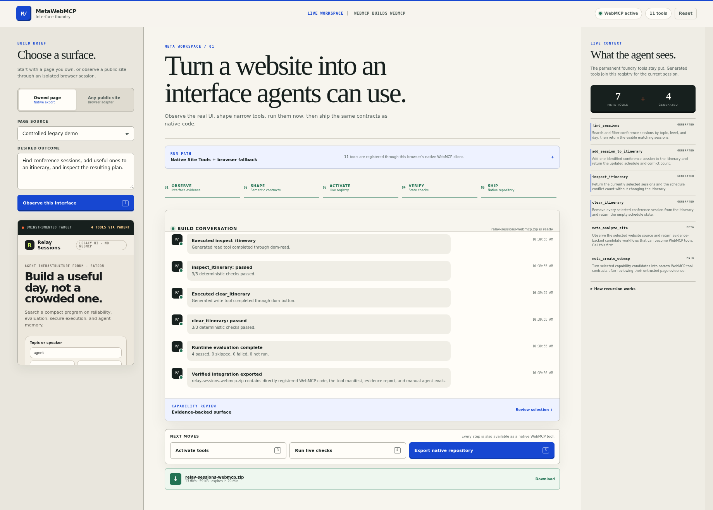

# MetaWebMCP

**A WebMCP application that creates other WebMCP applications.**

**Live application:** https://metawebmcp.neuryta.com

MetaWebMCP exposes a permanent WebMCP control plane that lets an agent inspect a website, turn observed workflows into narrow semantic tools, register those tools immediately on the same top-level page, verify their execution, and export a standalone native integration repository.

The central demonstration is recursive:

```text
ChatGPT / a WebMCP agent
        │
        │ calls MetaWebMCP's seven permanent tools
        ▼
MetaWebMCP control plane
        │ analyze → contract → activate → test → export
        ▼
Dynamically registered domain tools
        │
        │ find_sessions / add_session_to_itinerary / ...
        ▼
An ordinary website that initially had no WebMCP tools
```

No model API key is required. The browser agent supplies the reasoning and calls the meta-tools. MetaWebMCP handles deterministic discovery, contracts, runtime registration, execution, tests, and code generation.



## Production proof

The deployed build has been exercised through a real browser `document.modelContext`: seven permanent tools became eleven after activation, all four generated-tool checks passed, and the downloaded 13-file repository registered and ran the same four tools independently. Through that same native entrypoint, the session-scoped hosted adapter completed semantic search, a two-stage sign-in and cart workflow, and a visible page-state mutation across three public targets.

Screenshots and redacted machine-readable results are retained in [`evidence/`](evidence/). Three mobile Lighthouse samples gave the production workspace a 100 median performance score (94–100) and 100 for accessibility, best practices, SEO, and agentic browsing; the independently served native export scored 100 in all five categories. The exact production-generated [`relay-sessions-webmcp.zip`](evidence/relay-sessions-webmcp.zip) is retained alongside its SHA-256 digest and independent execution result.

## Run it in ChatGPT

The native Site Tools path currently requires the latest ChatGPT desktop app's built-in browser, opened to MetaWebMCP as a top-level page. Use ChatGPT Work or Codex with GPT‑5.6 Sol or Terra. Site Tools are disabled on Luna, unavailable in ChatGPT Enterprise and Edu, and still rolling out, so an otherwise eligible workspace may not expose them yet. See the current [Site Tools setup reference](https://learn.chatgpt.com/docs/webmcp).

When native discovery is available, the header reads **WebMCP active** and the seven `meta_*` tools appear in the client. If the header reads **Preview registry**, the ordinary browser fallback exercises the same implementations without native tool discovery:

1. Keep **Owned page → Controlled legacy demo**, then select **Observe this interface** (1).
2. Review the evidence-backed candidates and select **Shape selected tools** (2).
3. Select **Activate tools** (3).
4. Select **Run live checks** (4).
5. Select **Export native repository** (5), download the ZIP, and compare it with the retained production evidence.

The controlled fallback needs no account, credentials, model API, or external service. It demonstrates the same analysis, contract creation, dynamic registry, deterministic checks, and native export; only client-driven intent selection is replaced by explicit button presses.

## What is included

- A polished, top-level MetaWebMCP workspace.
- Seven permanent imperative WebMCP tools:
  - `meta_analyze_site`
  - `meta_create_webmcp`
  - `meta_activate_webmcp`
  - `meta_test_webmcp`
  - `meta_export_webmcp`
  - `meta_get_state`
  - `meta_reset_workspace`
- A controlled “legacy” conference planner with no WebMCP implementation of its own.
- Live DOM analysis that derives four domain tools from that target.
- Dynamic registration and unregistration through `document.modelContext.registerTool(...)` and `AbortController`.
- A dependency-free native integration ZIP generator. Controlled and browser-derived ToolSpecs both execute on an owned page without MetaWebMCP; bundled targets are tested as standalone WebMCP sites.
- URL and pasted-HTML analysis for site owners.
- An optional Streamable HTTP client for the official Playwright MCP server, used as the low-level runtime for third-party sites. A same-origin deployment keeps the transport session in the open page; the local Node service provides an isolated server-side fallback.
- SSRF defenses, an allowlisted browser recipe executor, risk annotations, and disabled consequential actions.
- Node unit tests and a Chromium end-to-end test that drives the full recursive sequence through a WebMCP-shaped browser mock.

## Run locally

Requirements: Node.js 20 or newer. There is no `npm install` step because the core application has no runtime dependencies.

```bash
npm start
# open http://localhost:8787
```

The controlled demo works immediately. Use the numbered actions or invoke the tools from a WebMCP-enabled agent:

```text
1. meta_analyze_site({ source: "demo", goal: "Find sessions and build an itinerary" })
2. meta_create_webmcp({})
3. meta_activate_webmcp({})
4. find_sessions({ query: "agent", level: "all", day: "all" })
5. add_session_to_itinerary({ item_id: "agent-evals-that-catch-regressions" })
6. meta_test_webmcp({})
7. meta_export_webmcp({ project_name: "relay-sessions-webmcp" })
```

After step 3, the top-level page contains eleven tools: seven meta-tools and four newly generated domain tools. The target iframe remains uninstrumented; all agent-facing registration occurs in the parent page.

## Modes

### Owned page

Choose one of three inputs:

- **Controlled legacy demo:** analyzes a live same-origin application, activates the generated tools, executes them, and exports native code.
- **Public URL:** safely fetches server-rendered HTML, extracts stable forms and action groups, and exports an integration pack.
- **Pasted HTML:** performs the same analysis without a network request.

The desired outcome is part of candidate selection: when a page exposes more than twelve workflows, normalized goal-token overlap chooses the strongest twelve, document order breaks ties, and the workspace reports how many candidates were omitted.

A generated pack includes:

```text
<project>/
├── README.md
├── AGENTS.md
├── LICENSE
├── package.json
├── serve.mjs
├── index.html
├── integration-report.html
├── target.css                 # when target source was bundled
├── target.js                  # when target source was bundled
├── src/
│   ├── webmcp.generated.js
│   └── tool-spec.json
├── metawebmcp-report.json
└── tests/manual-evals.md
```

The generated module contains direct `document.modelContext.registerTool(...)` calls. For the controlled demo and pasted HTML, `index.html` includes the target UI with that module installed, so the exported repository can be run and tested immediately. DOM adapters remain an installation bridge; in an owned repository, replace clicks and selectors with existing client functions, stores, API clients, and permission checks.

### Any public site

MetaWebMCP can connect to a standard Streamable HTTP browser MCP endpoint. The generated WebMCP tools stay semantic; low-level `browser_snapshot`, `browser_type`, `browser_click`, and related calls remain hidden behind the adapter.

The recipe runtime reads the connected tool schemas and supports both the current Playwright MCP `target` reference field and the Cloudflare package's `ref` field. Repeated controls such as product-level “Add to basket” buttons are collapsed into one item-scoped tool instead of flooding the registry with duplicate actions.

Exporting this mode produces the same reviewed ToolSpecs with an owned-page runtime based on accessible names and bounded item context. Developers can install the generated module directly in the target application without shipping MetaWebMCP or a browser service, then replace compatibility lookups with stable application functions as they harden the integration.

Start both services with Docker Compose:

```bash
docker compose up --build
# MetaWebMCP: http://localhost:8787
# Playwright MCP: http://localhost:8931/mcp
```

Or start Playwright MCP separately:

```bash
npx @playwright/mcp@latest \
  --headless \
  --browser chromium \
  --isolated \
  --image-responses omit \
  --port 8931

BROWSER_MCP_URL=http://127.0.0.1:8931/mcp npm start
```

The Node bridge validates initial URLs, blocks private/reserved networks by default, and can restrict initial browser targets with `BROWSER_ALLOWED_ORIGINS`. Browser operations require a short-lived, signed, HttpOnly page capability, and server-side browser clients are keyed by both that capability and the page workspace. Generated recipes cannot issue new navigation calls. The hosted Browser MCP endpoint narrows its advertised operations, validates explicit navigation, and blocks direct local, private, reserved, and common metadata destinations inside the browser context. Application checks do not replace network egress policy or defend completely against DNS rebinding; keep the browser isolated and unauthenticated.

## Configuration

| Variable | Default | Purpose |
|---|---:|---|
| `PORT` | `8787` | HTTP port |
| `HOST` | `0.0.0.0` | Bind address |
| `BROWSER_MCP_URL` | empty | Streamable HTTP endpoint, normally `http://127.0.0.1:8931/mcp` |
| `MCP_CAPABILITY_SECRET` | random per process | Secret of at least 32 bytes used to sign page-issued Browser MCP capabilities; set explicitly when running multiple instances |
| `MCP_SESSION_TTL_MS` | `1200000` | Inactivity timeout for each page-scoped Browser MCP client |
| `ALLOW_PRIVATE_TARGETS` | `0` | Local development override; never enable on a public deployment |
| `BROWSER_ALLOWED_ORIGINS` | empty | Optional comma-separated initial target origin allowlist |

## Tests

```bash
npm run check
npm run test:unit
npm run test:e2e
npm test
```

The end-to-end test launches the included server and an available Chromium build, injects a minimal implementation of the current imperative `registerTool`, `getTools`, and `executeTool` contract, and invokes every operation through that registered surface. It verifies:

1. Seven control-plane tools register.
2. The legacy target has no registered WebMCP tools.
3. Live analysis produces evidence-backed capabilities.
4. Activation increases the parent registry from seven to eleven tools.
5. Generated semantic tools mutate and read real target state.
6. Deterministic evals pass.
7. The exported ZIP opens and contains directly registered WebMCP source.
8. The extracted repository registers and executes its four generated WebMCP tools against the bundled target UI.
9. The completed workspace remains usable from desktop down to a 390 px mobile viewport without horizontal overflow.

The unit/integration suite also verifies both transport layouts: isolated server-side workspaces and one Streamable HTTP session owned by the open page from analysis through generated-tool execution.

See [`TEST_REPORT.md`](TEST_REPORT.md) for the exact environment and latest run.

Production-native and public-site evidence is retained in [`evidence/`](evidence/), including exact tool surfaces, postconditions, console-error records, screenshot hashes, and deployment version.

## Design constraints

- MetaWebMCP uses the imperative API on the top-level page. It does not depend on tool discovery inside an iframe.
- Generated tools are small and domain-specific rather than exposing an entire browser MCP tool surface.
- Target content and generated metadata are treated as untrusted.
- Consequential tools can be generated for review but are not automatically executed in the public studio.
- Browser MCP recipes are restricted to a small allowlist and have a maximum step count.
- The static analyzer is intentionally conservative. Client-rendered sites should use Browser MCP mode.
- The app remains usable as an ordinary human interface where WebMCP is not present; its internal registry provides the same deterministic demo path.

## Deployment

The repository includes:

- `deploy/cloudflare/` for the live single-origin Worker, Browser Run Durable Object, rate limiter, and static assets.
- `Dockerfile` for any container host.
- `render.yaml` for a basic Render deployment.
- `docker-compose.yml` for MetaWebMCP plus Playwright MCP.
- GitHub Actions CI for static, unit, and Chromium end-to-end tests.

The showcase deployment runs at https://metawebmcp.neuryta.com. Its page-owned MCP session uses Cloudflare Browser Rendering for the “any site” path; the controlled recursive flow and native exports use the same origin without requiring a browser session. See [`deploy/cloudflare/README.md`](deploy/cloudflare/README.md) for the reproducible deployment and compatibility pins.

## Repository guide

```text
lib/analyzer.mjs             conservative HTML and accessibility-tree analysis
lib/generator.mjs            native integration repository generator
public/js/mcp-http-client.js shared dependency-free Streamable HTTP MCP client
public/js/browser-mcp-session.js page-scoped browser session with Node fallback
public/js/mcp-recipe.js      shared allowlisted recipe interpreter
lib/security.mjs             URL, DNS, redirect, and network validation
lib/zip.mjs                  dependency-free ZIP writer
public/js/app.js             meta-tool control plane and UI state machine
public/js/webmcp-runtime.js  dual internal/native registry and executors
public/demo/                 target application with no WebMCP registration
tests/                       unit and full recursive browser tests
```

More detail is in [`ARCHITECTURE.md`](ARCHITECTURE.md), [`SECURITY.md`](SECURITY.md), and [`DEVPOST.md`](DEVPOST.md).

## License

MIT.

## Primary references

- WebMCP imperative API: https://developer.chrome.com/docs/ai/webmcp/imperative-api
- ChatGPT site tools: https://learn.chatgpt.com/docs/webmcp
- WebMCP draft specification: https://webmachinelearning.github.io/webmcp/
- Playwright MCP: https://github.com/microsoft/playwright-mcp
