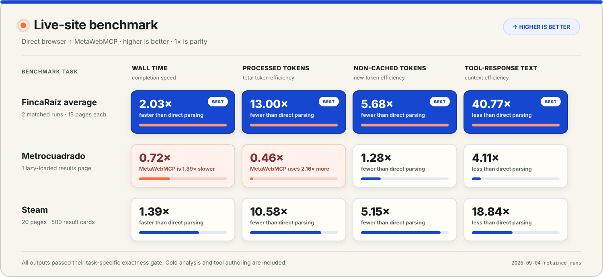

# MetaWebMCP

**Build, test, and export WebMCP tools from live website workflows.**

**Try it:** [metawebmcp.neuryta.com](https://metawebmcp.neuryta.com)

Most websites still make an agent work at the browser-control level: inspect a
page, find a control, act, and inspect again. MetaWebMCP lets a WebMCP client
turn an observed workflow into a small, named tool with a closed schema and
bounded behavior.

The tool is registered immediately on the MetaWebMCP page. The same reviewed
ToolSpec is used for live execution, checks, and a standalone export, so the
integration you download is the one you tested.

MetaWebMCP itself exposes seven permanent tools, which makes the flow recursive:

```text
ChatGPT / a WebMCP agent
        │
        │ calls MetaWebMCP's seven permanent tools
        ▼
MetaWebMCP control plane
        │ analyze → contract → activate → test → export
        ▼
Dynamically registered domain tools
        │
        │ find_sessions / add_session_to_itinerary / ...
        ▼
An ordinary website that initially had no WebMCP tools
```

No model API key is required. The WebMCP client decides what the observed
workflow means; MetaWebMCP handles discovery, contract validation, runtime
registration, execution, tests, and code generation.


## Why not save a browser script?

For a one-off automation, saving a Playwright script may be the right answer.
MetaWebMCP is aimed at the point where that workflow needs a stable interface
that WebMCP clients can discover and a site owner can adopt.

A script mainly packages an implementation. A generated WebMCP integration
also defines the public interface: its semantic name, input schema, supporting
page evidence, risk classification, sample arguments, and execution bounds.
MetaWebMCP registers that contract for immediate use, tests it, and exports it
as a native project. A site owner can then replace the compatibility DOM
lookups with application functions and existing permission checks.

A script platform can add schemas, discovery, sandboxing, lifecycle management,
tests, and installable packaging. At that point it covers much of the same
ground. MetaWebMCP provides those pieces as a constrained path from an observed
workflow to a WebMCP capability.

The benchmarks below compare MetaWebMCP with repeated browser-snapshot
inspection, not with hand-optimized reusable scripts. They measure context
compression and cold-start tradeoffs, not a universal performance advantage.

## Production proof

The deployed build has been exercised through a real browser `document.modelContext`: seven permanent tools became eleven after activation, all four generated-tool checks passed, and the downloaded 13-file repository registered and ran the same four tools independently. Through that same native entrypoint, the session-scoped hosted adapter completed semantic search, a two-stage sign-in and cart workflow, and a visible page-state mutation across three public targets.

Screenshots and redacted machine-readable results are retained in [`evidence/`](evidence/). Three mobile Lighthouse samples gave the production workspace a 100 median performance score (99–100) and 100 for accessibility, best practices, SEO, and agentic browsing; the independently served native export scored 100 in all five categories. The exact production-generated [`relay-sessions-webmcp.zip`](evidence/relay-sessions-webmcp.zip) is retained alongside its SHA-256 digest and independent execution result.

### Live-site benchmarks

For each arm, a fresh isolated Codex process used the same model and reasoning
setting. The direct arm read Playwright accessibility snapshots. The
MetaWebMCP arm began without a domain tool, analyzed the site, authored and
activated a constrained ToolSpec, and invoked it. Its times include cold
analysis, authoring retries, activation, execution, and final formatting. Both
arms had to pass the same task-specific correctness gate before their
efficiency numbers were compared.



The chart reports **direct browser ÷ MetaWebMCP**, so values above 1× favor
MetaWebMCP. The FincaRaíz row averages each arm's two matched runs; with two
runs, it is the same value as the median in the retained summary. Rebuild the
graphic from the checked-in manifests with
`python3 scripts/render-benchmark-chart.py`.

#### Tasks

- **FincaRaíz (average of two matched runs):** Scan rent-sorted Bogotá
  apartment results until the stopping condition is proved; both runs needed
  13 pages. Return the 50 cheapest unique listings with at least two bedrooms,
  45–100 m², and an explicit laundry-area phrase, ranked by rent plus any
  administration fee.
- **Metrocuadrado:** Read one tall, lazy-rendered Bogotá results page, combine
  promoted and ordinary cards, and return the 10 cheapest unique listings with
  at least two bedrooms and 45–100 m². Rent, area, and canonical URL determine
  the order.
- **Steam:** Inspect exactly 20 pages of Windows specials, covering 500 result
  cards, and return the top 50 unique games inside fixed discount, original
  price, and sale-price ranges. Sale price, discount, original price, and URL
  determine the order.

The consistent result was context compression: model-facing tool text fell by
4.11× to 40.77× and non-cached tokens fell by 1.28× to 5.68×. On the two
multipage tasks, that was enough to offset cold tool authoring and improve wall
time by 1.39× to 2.03×. Steam used more low-level browser operations internally,
but those responses stayed behind the generated tool instead of entering the
managing process's context.

Metrocuadrado shows the other side of the tradeoff. Direct inspection finished
45.208 seconds sooner, and MetaWebMCP processed 2.16× more total tokens because
the single-page task did not amortize analysis and authoring. MetaWebMCP still
used 22% fewer non-cached tokens and exposed 76% less tool-response text.

These are small, point-in-time tests against volatile third-party pages, not a
statistical performance estimate. Metrocuadrado's URL cleanup happened in the
schema-constrained final response rather than inside the generated ToolSpec.
Steam's reported correctness uses a documented post-run fix to an oracle parser;
the original failed scores are retained. Full methods, prompts, limitations,
oracles, token accounting, and machine-readable results are in
[`benchmarks/fincaraiz/`](benchmarks/fincaraiz/),
[`benchmarks/metrocuadrado/`](benchmarks/metrocuadrado/), and
[`benchmarks/steam/`](benchmarks/steam/).

## Run it with native WebMCP

Choose either native path:

- **ChatGPT Site Tools:** Open MetaWebMCP as a top-level page in the latest ChatGPT desktop app's built-in browser. Use ChatGPT Work or Codex with GPT‑5.6 Sol or Terra. Site Tools are disabled on Luna, unavailable in ChatGPT Enterprise and Edu, and still rolling out, so an otherwise eligible workspace may not expose them yet. See the current [Site Tools setup reference](https://learn.chatgpt.com/docs/webmcp).
- **Google Chrome 149 or later:** Open `chrome://flags/#enable-webmcp-testing`, enable the WebMCP testing flag, restart Chrome, then open the deployed URL as a top-level page.

The overview loads first. Choose **Build a WebMCP recipe** to enter the visible
workspace, or open <https://metawebmcp.neuryta.com/#workspace> directly. The
seven permanent `meta_*` tools register on the top-level page even while the
overview is visible. In the workspace, confirm that the header reads **WebMCP
active** and the tools appear in the client. If the header reads **Preview
registry**, the ordinary browser fallback exercises the same implementations
without native tool discovery:

1. Enter a public URL and select **Open and inspect website** (1), or choose **Use sample** for the deterministic Relay Sessions target.
2. Review the evidence-backed candidates and select **Shape selected tools** (2).
3. Select **Activate tools** (3).
4. Select **Run live checks** (4).
5. Select **Export native repository** (5), download the ZIP, and compare it with the retained production evidence.

The controlled fallback needs no account, credentials, model API, or external service. It demonstrates the same analysis, contract creation, dynamic registry, deterministic checks, and native export; only client-driven intent selection is replaced by explicit button presses.

## What is included

- A compatibility-first landing page and polished top-level MetaWebMCP workspace.
- Seven permanent imperative WebMCP tools:
  - `meta_analyze_site`
  - `meta_create_webmcp`
  - `meta_activate_webmcp`
  - `meta_test_webmcp`
  - `meta_export_webmcp`
  - `meta_get_state`
  - `meta_reset_workspace`
- A controlled “legacy” conference planner with no WebMCP implementation of its own.
- Live DOM analysis that derives four domain tools from that target.
- Dynamic registration and unregistration through `document.modelContext.registerTool(...)` and `AbortController`.
- A dependency-free native integration ZIP generator. Controlled and browser-derived ToolSpecs both execute on an owned page without MetaWebMCP; bundled targets are tested as standalone WebMCP sites.
- A URL-first hosted inspector that keeps the rendered target, accessibility model, generated recipes, and resulting state visible in one workspace.
- Managing-agent authoring of up to twelve domain tools grounded in observed capabilities, using constrained action recipes or typed collection plans.
- Reusable collection parsers, filters, computed fields, stable sorting, deduplication, bounded lazy-page capture, pagination, and ordered stopping proofs.
- Agent/API inputs for URL, HTML, and caller-controlled accessibility observations without exposing raw snapshot entry in the human interface.
- Browser-local IndexedDB autosave for drafts, analysis, reviewed contracts, recipes, evaluation state, and active generated tools.
- Expiring tokenized presentation workspaces that mirror the controlled demo from an agent browser into a separate read-only browser.
- A Streamable HTTP client for the official Playwright MCP server. The Cloudflare deployment keeps one isolated target session in the open page; the local Node service supports an isolated server-side equivalent when configured.
- SSRF defenses, an allowlisted browser recipe executor, risk annotations, and disabled consequential actions.
- Node unit tests and a Chromium end-to-end test that drives the full recursive sequence through a WebMCP-shaped browser mock.

## Run locally

Requirements: Node.js 20 or newer. There is no `npm install` step because the core application has no runtime dependencies.

```bash
npm start
# open http://localhost:8787
```

The controlled demo works immediately. Use the numbered actions or invoke the tools from a WebMCP-enabled agent:

```text
1. meta_analyze_site({ source: "demo", goal: "Find sessions and build an itinerary" })
2. meta_create_webmcp({})
3. meta_activate_webmcp({})
4. find_sessions({ query: "agent", level: "all", day: "all" })
5. add_session_to_itinerary({ item_id: "agent-evals-that-catch-regressions" })
6. meta_test_webmcp({})
7. meta_export_webmcp({ project_name: "relay-sessions-webmcp" })
```

After step 3, the top-level page contains eleven tools: seven meta-tools and four newly generated domain tools. The target iframe remains uninstrumented; all agent-facing registration occurs in the parent page.

## Inspection paths

### Owned page

The WebMCP control plane accepts three owner-oriented inputs:

- **Controlled legacy demo:** analyzes a live same-origin application, activates the generated tools, executes them, and exports native code.
- **Public URL:** safely fetches server-rendered HTML, extracts stable forms and action groups, and exports an integration pack.
- **Pasted HTML:** performs the same analysis without a network request.

The desired outcome is part of candidate selection: when a page exposes more than twelve workflows, normalized goal-token overlap chooses the strongest twelve, document order breaks ties, and the workspace reports how many candidates were omitted.

A generated pack includes:

```text
<project>/
├── README.md
├── AGENTS.md
├── LICENSE
├── package.json
├── serve.mjs
├── index.html
├── integration-report.html
├── target.css                 # when target source was bundled
├── target.js                  # when target source was bundled
├── src/
│   ├── webmcp.generated.js
│   └── tool-spec.json
├── metawebmcp-report.json
└── tests/manual-evals.md
```

The generated module contains direct `document.modelContext.registerTool(...)` calls. For the controlled demo and pasted HTML, `index.html` includes the target UI with that module installed, so the exported repository can be run and tested immediately. DOM adapters remain an installation bridge; in an owned repository, replace clicks and selectors with existing client functions, stores, API clients, and permission checks.

### Any public site

The visible workspace is URL-first. Enter a public HTTP(S) URL and MetaWebMCP opens it in an isolated hosted browser, captures both the rendered page and accessibility model, and displays them as switchable **Page view** and **Accessibility** panels. Generated tools execute in that same bounded session; after each action, the page view and accessibility result refresh in the workspace.

If a calling agent already controls an authorized target session, it can use the advanced tool-only observation path without asking a person to copy data between browsers:

```text
meta_analyze_site({
  source: "agent_snapshot",
  url: "https://example.com/",
  goal: "Search the catalog",
  snapshot: "<accessibility snapshot from the caller's browser>"
})
```

The analysis response includes evidence-backed capability IDs, collection
scaffolds where repeated links were observed, the supported executor types,
and the common parser catalog. The managing agent can either accept and rename
the inferred candidates or pass complete definitions in
`meta_create_webmcp({ authored_tools: [...] })`. This permits arbitrary domain
semantics expressible as a bounded `mcp-recipe` or `mcp-collection`: custom
input schemas, multiple observed capabilities per tool, typed extraction,
filters, computed sums, sorting, limits, and pagination.

MetaWebMCP validates the definitions, fixes collection navigation to the
analyzed origin and path, rejects risk downgrades and ungrounded collection
matchers, and registers the resulting ToolSpecs immediately. It does not
accept JavaScript or expose a generic browser MCP escape hatch.

While caller-browser tools are active on the studio page, invoking a recipe or
collection returns a validated `agent_browser_required` plan with
`completed: false`; the calling agent performs it in its retained target
session and verifies the result. This path is an agent-to-agent API contract,
not a textarea in the human workspace.

Controls without accessible names are not converted into generic tools. The analysis reports how many were omitted and identifies inputs that could not be associated with a named submit action, so the caller knows where direct browser judgment or a source-site accessibility fix is still required.

In the hosted path, generated WebMCP tools stay semantic while low-level
`browser_snapshot`, `browser_type`, `browser_click`, bounded collection
navigation, screenshot, and related calls remain hidden behind the adapter.

The recipe runtime reads the connected tool schemas and supports both the current Playwright MCP `target` reference field and the Cloudflare package's `ref` field. Repeated controls such as product-level “Add to basket” buttons are collapsed into one item-scoped tool instead of flooding the registry with duplicate actions.

Exporting this mode produces the same reviewed ToolSpecs with an owned-page
runtime based on accessible names and bounded item context. Single-page
collections execute directly; paginated collections use an explicit source
owner adapter or browser bridge. Developers can install the generated module
without shipping MetaWebMCP, then replace compatibility lookups with stable
application functions as they harden the integration.

## Browser-local persistence

MetaWebMCP automatically saves one workspace in IndexedDB for its current origin and browser profile. A reload restores input drafts, tool-supplied HTML or accessibility observations, analysis, capability selection and review drafts, generated ToolSpecs and recipes, evaluation history, trace history, and active generated tools. Normal workspaces are not synchronized between browsers or sent to a project database. Hosted browser images and sessions are intentionally transient; reopen the target to resume a live visual session.

Temporary export download links are deliberately not restored because their server-side archives are single-use and expire within twenty minutes. Hosted Browser MCP sessions are also not resumed; their saved contracts remain visible, but the target must be analyzed again before execution. **Reset** removes the browser-local record as well as the active generated tools. Clearing site data in the browser has the same effect. If IndexedDB is unavailable, the studio remains functional with in-memory state only.

Snapshots and pasted HTML can contain sensitive visible text. Do not supply credentials or secrets; browser-local persistence is accessible to scripts running on the same origin.

### Tokenized presentation handoff

Choose **Share demo** from the workspace to create an expiring presentation
session. The dialog returns two capability URLs:

1. Give the author URL to the agent that will operate MetaWebMCP.
2. Open the viewer URL in the browser used for the recording or presentation.
3. Run the controlled Relay Sessions flow in the author browser. The viewer
   loads new revisions automatically and shows the generated registry and
   target state without gaining mutation authority.

The two random bearer tokens are kept in URL fragments, so they are not sent in
page requests or referrers. Only their SHA-256 hashes are retained server-side.
The author token may read and update one workspace; the viewer token is
read-only. Sessions expire after one hour, and each update is schema-checked and
limited to 512 KB.

Cloud sharing deliberately accepts only a pristine workspace or the controlled
demo. The shared projection removes pasted HTML, accessibility snapshots, and
unknown top-level fields. Browser MCP sessions, page images, and temporary
export URLs are never transferred. Editable goals and reviewed tool metadata
are synchronized, so do not place credentials or secrets in them. IndexedDB
remains the author browser's local recovery path.

Start the application, isolated browser, and guarded egress proxy with Docker Compose:

```bash
docker compose up --build
# MetaWebMCP: http://localhost:8787
# Playwright MCP is reachable only by the application on the internal network
```

The Compose browser has no direct route outside its internal network. Chromium sends HTTP and HTTPS through `egress-proxy.mjs`, including destinations it would normally exempt as loopback. The proxy resolves every new connection, rejects the destination if any answer is private or reserved, permits only ports 80 and 443, and connects to the validated address rather than resolving it again. Redirects and subresources therefore cross the same boundary. `BROWSER_MCP_EGRESS_ISOLATED=1` only declares that an equivalent boundary exists; it does not create one, and the Node service refuses to enable Browser MCP without it.

Browser operations also require a short-lived, signed, HttpOnly page capability, and server-side browser clients are keyed by both that capability and the page workspace. Generated action recipes cannot issue navigation calls; collection pagination can only substitute page numbers into a validated same-origin/path template. `BROWSER_ALLOWED_ORIGINS` can further constrain initial and observed final navigation origins. On the hosted Cloudflare path, every browser HTTP request is fulfilled through a size- and time-bounded Worker `fetch()` using public-Internet routing; redirects are returned to Chromium and intercepted again. Worker contexts, service workers, WebSockets, WebTransport, and WebRTC are disabled so page code cannot bypass that HTTP boundary.

## Configuration

| Variable | Default | Purpose |
|---|---:|---|
| `PORT` | `8787` | HTTP port |
| `HOST` | `0.0.0.0` | Bind address |
| `BROWSER_MCP_URL` | empty | Streamable HTTP endpoint, normally `http://127.0.0.1:8931/mcp` |
| `BROWSER_MCP_EGRESS_ISOLATED` | `0` | Required declaration that the configured browser runtime has enforced connection-level private-network egress controls |
| `MCP_CAPABILITY_SECRET` | random per process | Secret of at least 32 bytes used to sign page-issued Browser MCP capabilities; set explicitly when running multiple instances |
| `MCP_SESSION_TTL_MS` | `1200000` | Inactivity timeout for each page-scoped Browser MCP client |
| `ANALYSIS_RATE_LIMIT_PER_MINUTE` | `30` | Process-wide Node analysis request limit |
| `MAX_CONCURRENT_ANALYSES` | `4` | Maximum simultaneous Node analysis requests |
| `MAX_PENDING_EXPORTS` | `8` | Maximum ZIP archives retained for pending Node downloads |
| `MAX_PENDING_EXPORT_BYTES` | `16000000` | Maximum total bytes retained across pending Node downloads |
| `MAX_EXPORT_ARCHIVE_BYTES` | `3000000` | Maximum generated ZIP size accepted by the Node runtime |
| `EXPORT_RATE_LIMIT_PER_MINUTE` | `12` | Process-wide Node export generation limit |
| `MAX_SHARED_WORKSPACES` | `32` | Maximum concurrent expiring presentation workspaces in the Node runtime |
| `SHARED_WORKSPACE_RATE_LIMIT_PER_MINUTE` | `12` | Process-wide Node presentation-session creation limit |
| `SHARED_WORKSPACE_TTL_MS` | `3600000` | Presentation workspace lifetime from creation, capped at 24 hours |
| `ALLOW_PRIVATE_TARGETS` | `0` | Local development override; never enable on a public deployment |
| `BROWSER_ALLOWED_ORIGINS` | empty | Optional comma-separated initial target origin allowlist |

The Cloudflare deployment additionally recognizes `HOSTED_BROWSER_ENABLED`. The showcase configuration sets it to `1` so the URL-first website viewer works from the page; set it to `0` to disable anonymous Browser Run usage. The controlled sample and agent/API observation inputs remain available without it.

## Tests

```bash
npm run check
npm run test:unit
npm run test:e2e
npm test
```

The end-to-end test launches the included server and an available Chromium build, injects a minimal implementation of the current imperative `registerTool`, `getTools`, and `executeTool` contract, and invokes every operation through that registered surface. It verifies:

1. Seven control-plane tools register.
2. The legacy target has no registered WebMCP tools.
3. Live analysis produces evidence-backed capabilities.
4. Activation increases the parent registry from seven to eleven tools.
5. Generated semantic tools mutate and read real target state.
6. Deterministic evals pass.
7. The exported ZIP opens and contains directly registered WebMCP source.
8. The extracted repository registers and executes its four generated WebMCP tools against the bundled target UI.
9. The human workspace exposes a URL-first website inspector rather than snapshot/HTML paste controls, and shows hosted page images plus the accessibility model in switchable views.
10. A hosted generated-tool execution refreshes both the visible page image and accessibility result.
11. A reviewed caller-browser workspace, including its generated execution plan, survives a real page reload; temporary export links do not, and Reset removes the saved record.
12. Separate browser profiles receive controlled-demo registry and target-state updates through distinct read/write tokens, while the viewer remains read-only.
13. The completed workspace remains usable from desktop down to a 390 px mobile viewport without horizontal overflow.

The unit/integration suite verifies caller-supplied observation analysis, recipe and collection handoff, collection parsing and navigation bounds, and both hosted transport layouts: isolated server-side workspaces and one page-owned MCP session from analysis through generated-tool execution and visual capture.

See [`TEST_REPORT.md`](TEST_REPORT.md) for the exact environment and latest run.

Production-native and public-site evidence is retained in [`evidence/`](evidence/), including exact tool surfaces, postconditions, console-error records, screenshot hashes, and deployment version.

## Design constraints

- MetaWebMCP uses the imperative API on the top-level page. It does not depend on tool discovery inside an iframe.
- Generated tools are small and domain-specific rather than exposing an entire browser MCP tool surface.
- Target content and generated metadata are treated as untrusted.
- Consequential tools can be generated for review but are not automatically executed in the public studio.
- Browser MCP recipes are restricted to a small allowlist and have a maximum step count. Collection tools have fixed origin/path scope and bounded fields, filters, result size, records, and pages.
- The static analyzer is intentionally conservative. The main client-rendered-site flow uses the hosted website viewer; calling agents may instead submit an accessibility observation through `meta_analyze_site` when they already control the target session.
- The app remains usable as an ordinary human interface where WebMCP is not present; its internal registry provides the same deterministic demo path.

## Deployment

The repository includes:

- `deploy/cloudflare/` for the live single-origin Worker, Browser Run Durable Object, rate limiter, and static assets.
- `Dockerfile` for any container host.
- `render.yaml` for a basic Render deployment.
- `docker-compose.yml` for MetaWebMCP plus Playwright MCP.
- GitHub Actions CI for static, unit, and Chromium end-to-end tests.

The showcase deployment runs at https://metawebmcp.neuryta.com. Its default public-site path uses a page-owned Cloudflare Browser Run session so the target and its accessibility model remain visible inside MetaWebMCP. The controlled recursive sample and native exports do not require Browser Run; export creation and download still use the page's short-lived signed capability. See [`deploy/cloudflare/README.md`](deploy/cloudflare/README.md) for the reproducible deployment and compatibility pins.

## Repository guide

```text
egress-proxy.mjs             DNS-validating, address-pinning browser egress boundary
lib/analyzer.mjs             conservative HTML and accessibility-tree analysis
lib/generator.mjs            native integration repository generator
public/js/mcp-http-client.js shared dependency-free Streamable HTTP MCP client
public/js/browser-mcp-session.js page-scoped browser session with Node fallback
public/js/network-policy.js  shared private/reserved address and hostname policy
public/js/mcp-recipe.js      shared allowlisted recipe interpreter
public/js/mcp-collection.js  shared bounded collection interpreter and parsers
public/js/tool-authoring.js  managing-agent ToolSpec validation and grounding
public/js/workspace-store.js browser-local IndexedDB workspace record
public/js/shared-workspace.js tokenized author/viewer transport
lib/shared-workspace.mjs     shared record projection, authorization, and revision rules
lib/security.mjs             URL, DNS, redirect, and network validation
lib/zip.mjs                  dependency-free ZIP writer
public/js/app.js             meta-tool control plane and UI state machine
public/js/webmcp-runtime.js  dual internal/native registry and executors
public/demo/                 target application with no WebMCP registration
tests/                       unit and full recursive browser tests
```

More detail is in [`ARCHITECTURE.md`](ARCHITECTURE.md), [`SECURITY.md`](SECURITY.md), and [`DEVPOST.md`](DEVPOST.md).

## License

MIT.

## Primary references

- WebMCP imperative API: https://developer.chrome.com/docs/ai/webmcp/imperative-api
- ChatGPT site tools: https://learn.chatgpt.com/docs/webmcp
- WebMCP draft specification: https://webmachinelearning.github.io/webmcp/
- Playwright MCP: https://github.com/microsoft/playwright-mcp
