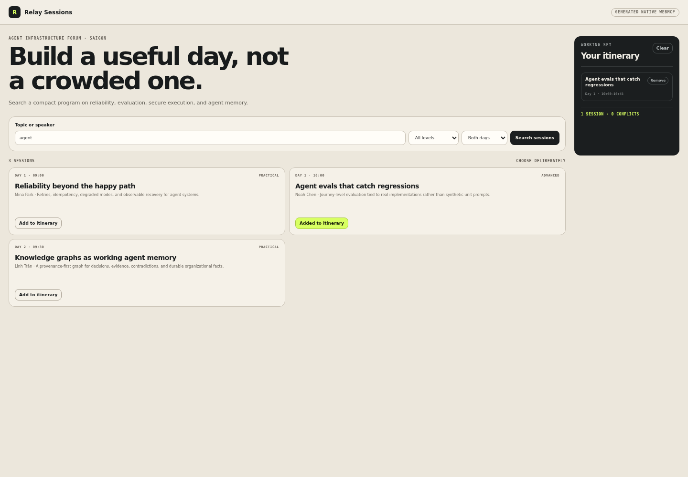
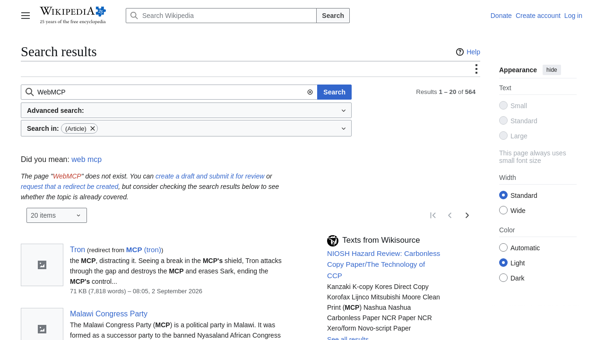
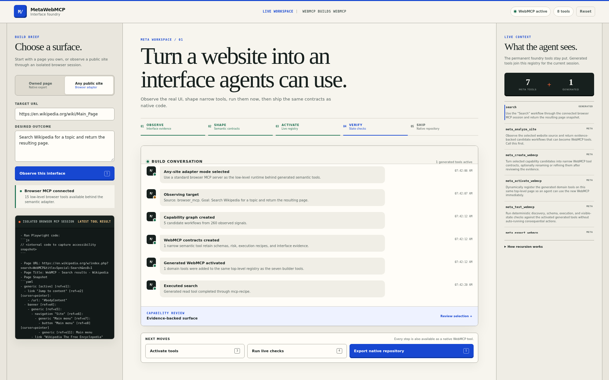
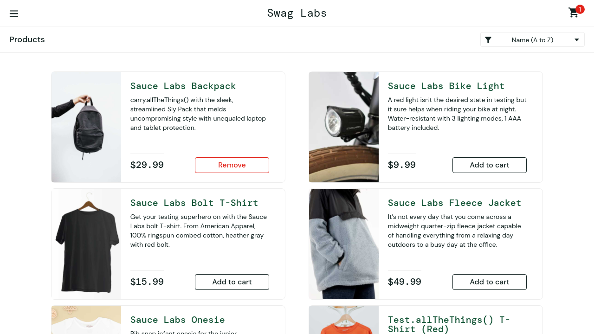
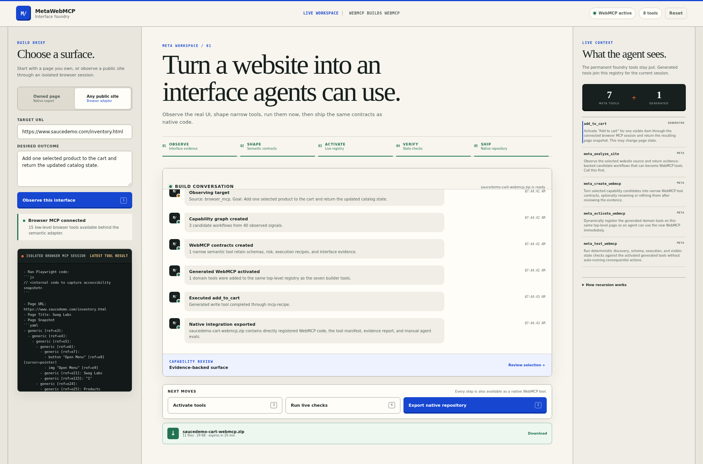
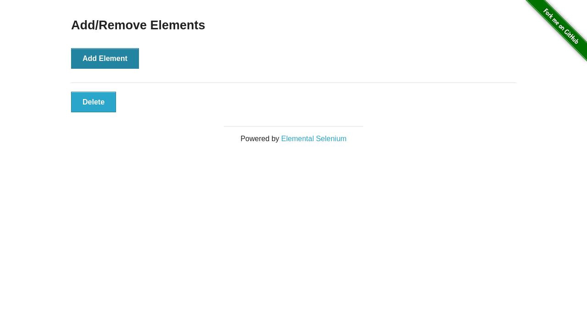
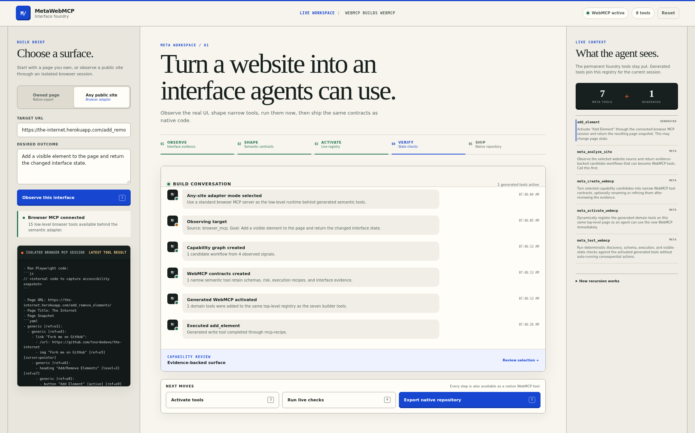

# Production evidence

These artifacts exercise the deployed workspace at <https://metawebmcp.neuryta.com> through native WebMCP and its hosted, session-scoped Browser MCP runtime. Machine-readable results retain the deployment version, exact tool surfaces, postconditions, workspace console errors, archive validation, and screenshot SHA-256 digests.

## Results at a glance

| Boundary | Observed result |
|---|---|
| Native WebMCP builder | A real `document.modelContext` exposed seven permanent tools, activation expanded the registry to eleven, and all four generated-tool checks passed. |
| Native exported repository | The downloaded 13-file repository directly registered four tools on its own page; search, add, and inspect calls changed and read the bundled application with no MetaWebMCP runtime. |
| Wikipedia | Generated `search(search_wikipedia)`, submitted `WebMCP`, and observed the query in the resulting search page snapshot. |
| SauceDemo | Generated `login(username, password)`, retained the same browser session, re-analyzed the authenticated catalog, generated `add_to_cart(item)`, changed the selected product control to “Remove,” and validated the exported one-tool native contract. The retained result redacts the password value. |
| The Internet | Generated `add_element()`, executed it, and observed the new “Delete” control in the resulting page state. |
| Production quality | Lighthouse 13.4.1 scored 96 for performance and 100 for accessibility, best practices, SEO, and agentic browsing. The independently served native export scored 100 in all five categories; both runs reported zero layout shift and no console errors. |

## Native WebMCP recursion

The controlled run used Google Chrome 154 beta with the documented WebMCP testing feature. Every call—analysis, contract creation, activation, generated tool use, verification, and export—went through tools discovered from the browser's real `document.modelContext`.

The resulting ZIP was then downloaded, extracted, started as an independent site, and opened in the same native browser. Its own top-level page registered `find_sessions`, `add_session_to_itinerary`, `inspect_itinerary`, and `clear_itinerary`. The screenshot shows state changed by those exported tools.

Exact results: [`native-webmcp-result.json`](native-webmcp-result.json)

## Session-scoped public-site adapters

Each target started in a fresh, isolated browser session. MetaWebMCP ran analyze → create → activate → generated semantic tool → reset. Every meta-tool and generated semantic call used tool objects discovered from the top-level page's native `document.modelContext`. The target screenshot came from that same remote session after execution; the workspace screenshot records the semantic contract and result visible to the calling page.

Workspace console failures are recorded independently from target-page postconditions in the JSON.

### Wikipedia search

| Target after generated-tool execution | MetaWebMCP workspace |
|---|---|
|  |  |

### SauceDemo sign-in and cart

| Target after generated-tool execution | MetaWebMCP workspace |
|---|---|
|  |  |

### The Internet state change

| Target after generated-tool execution | MetaWebMCP workspace |
|---|---|
|  |  |

Exact redacted results: [`public-site-results.json`](public-site-results.json)

## Quality profile

The production workspace scored 96 for performance and 100 in the other four Lighthouse categories. The independently served export scored 100 in all five. Both recorded zero cumulative layout shift and no console errors. Their summaries are retained in [`lighthouse-production-summary.json`](lighthouse-production-summary.json) and [`lighthouse-native-export-summary.json`](lighthouse-native-export-summary.json). The complete deterministic suite and its coverage boundary are documented in [`../TEST_REPORT.md`](../TEST_REPORT.md).

Third-party pages are shown only as limited functional-test evidence. Their names, interface content, and marks remain the property of their respective owners; MetaWebMCP is not affiliated with them.
